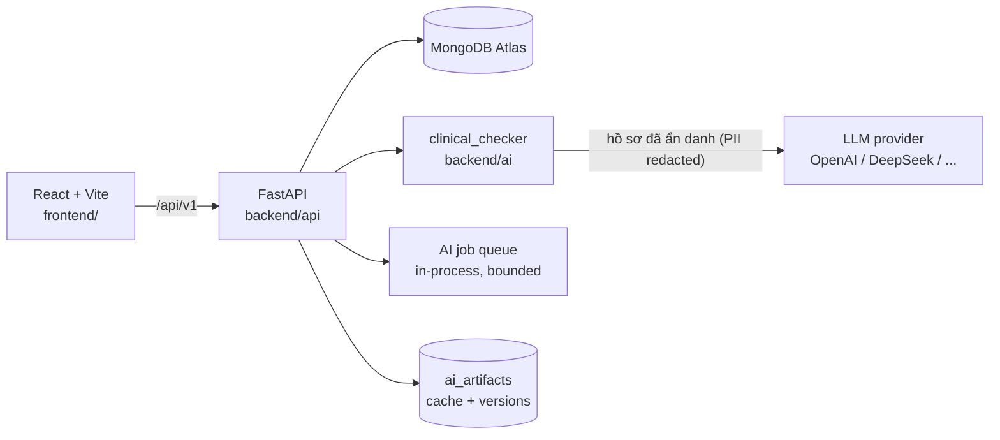

# Tháp Rùa Clinical Copilot

Nền tảng HIS/EMR cho phòng khám sản khoa, tích hợp **trợ lý AI hỗ trợ nhân viên y tế**: rà soát tuân thủ hồ sơ bệnh án, soạn nháp biên bản tư vấn in được, và tổng hợp kết quả xét nghiệm — tất cả theo nguyên tắc **bác sĩ quyết định, AI chỉ hỗ trợ** (human-in-the-loop).

> Mọi kết quả AI là gợi ý hoặc bản nháp chờ bác sĩ duyệt. AI không tự ghi vào hồ sơ, không chẩn đoán, không chỉ định điều trị. Khuyến cáo "Công cụ hỗ trợ kiểm tra, không thay thế đánh giá của nhân viên y tế" hiển thị thường trực.

## Tính năng

### Không gian khám bệnh (bác sĩ)
- Danh sách bệnh nhân theo trạng thái hàng đợi, tìm kiếm, hồ sơ khám đầy đủ (hành chính, sinh hiệu, thai kỳ, diễn biến, chẩn đoán ICD-10, hướng xử trí).
- **Kiểm tra hồ sơ (AI)** — đối chiếu hồ sơ với bộ tiêu chí khám thai (`rules/`, nhóm R01–R08), trả kết quả dạng "phiếu khám": tiêu chí chưa đạt kèm lý do, mức NGHIÊM TRỌNG đánh dấu riêng, **gợi ý sửa hiển thị ngay tại vị trí tương ứng** — bác sĩ bấm chấp nhận mới áp dụng vào hồ sơ.
- **Biên bản tư vấn** — AI soạn bản nháp theo đúng bệnh cảnh của ca (nguy cơ, kế hoạch theo dõi, dấu hiệu cần khám ngay); mở trong mẫu văn bản hành chính (quốc hiệu, thông tin bệnh nhân, chẩn đoán, khu ký tên hai bên), chỉnh sửa trực tiếp và **in / xuất PDF khổ A4**.
- **Tổng hợp xét nghiệm** — hệ thống đối chiếu số học trước, AI chỉ tóm tắt các chỉ số bất thường thành câu tiếng Việt theo mẫu cố định; xuất phiếu PDF.

### Trung tâm quản trị (lãnh đạo phòng khám)
- Thống kê tài khoản, tổng lượt gọi AI, độ trễ P95, chi phí AI quy đổi.
- Nhật ký sử dụng AI theo từng lượt (endpoint, model, token vào/ra, chi phí), quản lý tài khoản bác sĩ.

### Hạ tầng AI
- **Bảo vệ dữ liệu bệnh nhân**: allowlist trường được phép + xoá mẫu định danh (email, SĐT, số ID, mã BN/BHYT, ngày tuyệt đối) trước mọi lời gọi LLM; quét lần cuối **fail-closed** — còn nghi vấn PII là huỷ request.
- **Hàng đợi AI jobs** (`POST /ai/jobs` → poll) với giới hạn worker/độ sâu cấu hình được; quá tải trả `429 + Retry-After`.
- **Cache kết quả AI** theo hash(hồ sơ đã ẩn danh + bộ tiêu chí + prompt + model): hồ sơ không đổi → trả ngay, 0 token.
- **Phiên bản hoá hồ sơ** (`clinical_record_versions`) và gắn kết quả AI với phiên bản cụ thể để truy vết.
- **Audit đầy đủ**: mỗi lượt gọi ghi hash prompt/rules/input, phiên bản pipeline, latency, token — không ghi nội dung lâm sàng vào log kỹ thuật.
- **Không khoá vào một nhà cung cấp LLM**: đổi OpenAI / DeepSeek / Anthropic bằng biến môi trường, không sửa mã.

## Kiến trúc



```text
frontend/                 # React 18 + TypeScript + Vite, SCSS modules, Zustand
backend/
  api/                    # FastAPI: patients, clinical_records, lab, AI router, jobs, telemetry
    app/routers/          # ai.py, patients.py, clinical_records.py, lab_analysis.py, lab_reports.py
  ai/                     # clinical_checker: pipeline kiểm tra + sinh biên bản (stdlib-only)
    clinical_checker/     # privacy (PII), provider (LLM), pipeline, config, cli
rules/                    # Bộ tiêu chí chuyên môn (JSON): rules_kham_thai, rules_tu_van
data/                     # 6 ca khám thai mô phỏng (sim_kham1..6) — không có dữ liệu thật
scripts/                  # export_ai_evidence, load_test_ai_jobs
docs/                     # Tài liệu kiến trúc, pipeline AI, versioning/cache, CI/CD
```

## Bắt đầu nhanh

### Yêu cầu
- Node.js ≥ 20, Python ≥ 3.12
- (Tuỳ chọn) MongoDB Atlas cho lưu trữ + cache; không có vẫn chạy được các luồng demo

### Cài đặt

```bash
npm install                                # frontend workspaces
python3 -m venv backend/api/.venv
backend/api/.venv/bin/pip install -r backend/api/requirements.txt
```

### Cấu hình môi trường

| File | Dùng cho | Mẫu |
|---|---|---|
| `.env` (gốc) | Pipeline AI (`clinical_checker`): `LLM_PROVIDER`, `LLM_MODEL`, `LLM_API_KEY`, `LLM_BASE_URL`, `PII_FAIL_CLOSED`, `LLM_BATCH_SIZE`… | `.env.example` |
| `backend/api/.env` | API server: `MONGODB_URI`, `OPENAI_API_KEY` (lab analysis), Supabase keys, `AI_JOB_WORKERS`… | `backend/api/.env.example` |
| `frontend/.env.local` | `VITE_API_BASE_URL` (mặc định dùng Vite proxy → `localhost:4000`) | `frontend/.env.example` |

> Khoá API chỉ nằm phía server, không bao giờ khai báo qua biến `VITE_*`.

### Chạy development

```bash
npm run dev:backend    # FastAPI tại http://localhost:4000 (health: /health)
npm run dev:frontend   # Vite tại http://localhost:5173
```

Windows: chạy `start.bat`. Đăng nhập demo (không cần hạ tầng cloud):

| Tài khoản | Mật khẩu | Vai trò |
|---|---|---|
| `admin@thaprua.vn` | `Admin@123` | Quản trị → Trung tâm quản trị |
| `myhanh@thaprua.vn` / `thihuong@thaprua.vn` | `Bacsi@123` | Bác sĩ → Hồ sơ bệnh án |

Demo nhanh: đăng nhập bác sĩ → chọn ca `SIM-005` (đái tháo đường thai kỳ) → "Tạo biên bản tư vấn" → "In / Xuất PDF" → "Kiểm tra hồ sơ (AI)".

## Kiểm thử

```bash
cd backend/api && .venv/bin/python -m pytest        # API tests (jobs, cache, versions…)
npm run test:ai                                     # unit tests pipeline AI
npm run check:ai:dry                                # CLI: redact + quét PII, không gọi LLM
cd frontend && npx tsc --noEmit && npm run build    # typecheck + build frontend
python scripts/load_test_ai_jobs.py                 # load test hàng đợi AI
```

## Triển khai

- **Backend**: Render (`render.yaml`) — build từ `backend/api/requirements.txt`, health check `/health`, auto-deploy khi checks pass.
- **Frontend**: Railway — base URL API cấu hình qua `VITE_API_BASE_URL` (`frontend/src/api/config.ts`).
- Quy trình CI/CD và môi trường staging: xem [docs/github-render-cicd.md](docs/github-render-cicd.md).

## Tài liệu

| Tài liệu | Nội dung |
|---|---|
| [docs/architecture.md](docs/architecture.md) | Kiến trúc tổng thể, ranh giới API/AI, nguyên tắc human-in-the-loop |
| [docs/ai-clinical-compliance-pipeline.md](docs/ai-clinical-compliance-pipeline.md) | Pipeline kiểm tra tuân thủ: privacy, prompt, batching, telemetry |
| [docs/how-to-run-ai-compliance-checker.md](docs/how-to-run-ai-compliance-checker.md) | Hướng dẫn chạy checker qua CLI/API |
| [docs/ai-async-jobs-rate-limits.md](docs/ai-async-jobs-rate-limits.md) | Hàng đợi AI jobs, rate limit, chịu tải đồng thời |
| [docs/document-versioning-ai-cache.md](docs/document-versioning-ai-cache.md) | Phiên bản hoá hồ sơ và cache kết quả AI |
| [docs/pilot-plan.md](docs/pilot-plan.md) | Kế hoạch pilot 4 tuần, unit economics thực đo và mô hình giá SaaS |

## Bảo mật & dữ liệu

- Toàn bộ dữ liệu demo là **mô phỏng** (`data/sim_kham*.json`) — repo không chứa dữ liệu bệnh nhân thật.
- Thông tin định danh không rời khỏi hệ thống: xem `backend/ai/clinical_checker/privacy.py` (allowlist + scrub + fail-closed).
- File `.env*` nằm trong `.gitignore` — không commit khoá API hay chuỗi kết nối.
