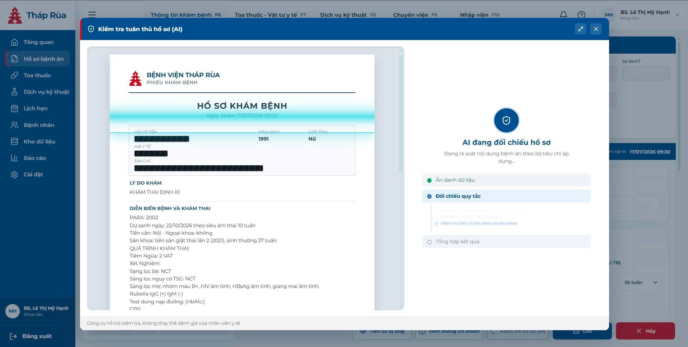
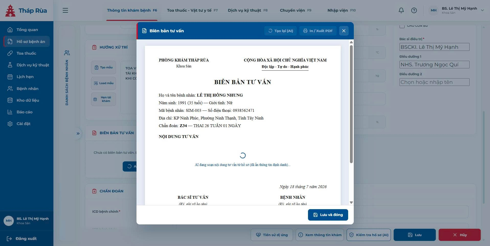
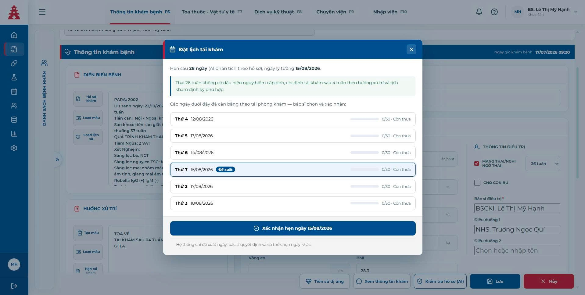
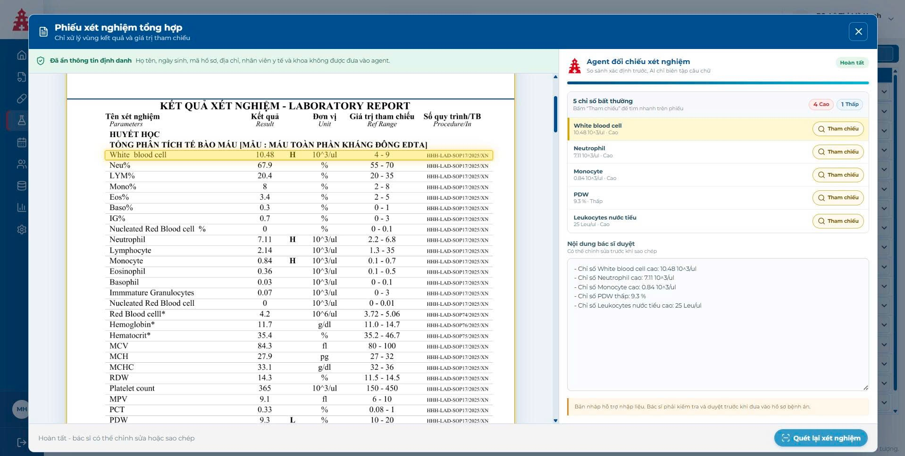
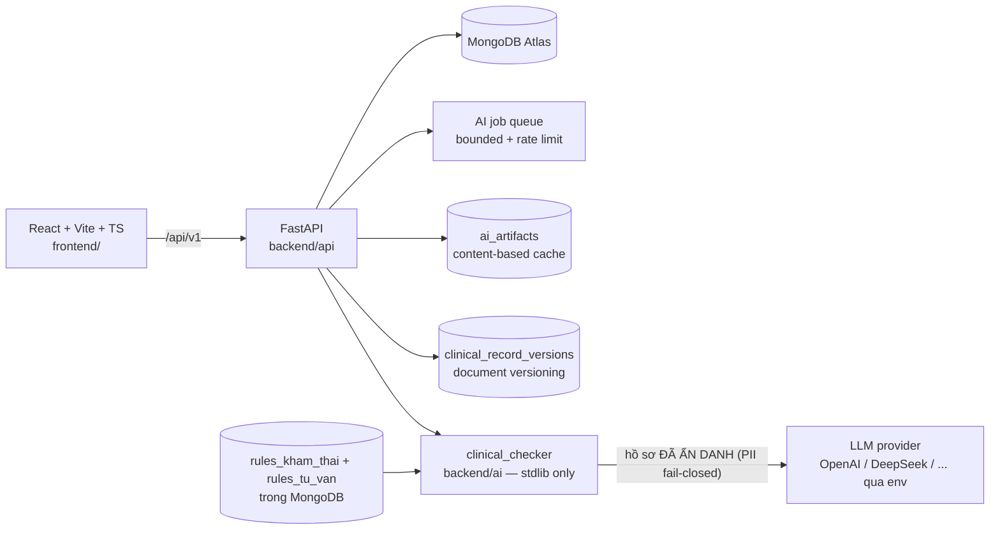

# Tháp Rùa Clinical Copilot

[](https://github.com/dquangai/thap-rua-clinical-copilot/actions/workflows/ci.yml)

**Trợ lý AI "non-intrusive" cho phòng khám sản khoa** — rà soát tuân thủ hồ sơ bệnh án theo bộ tiêu chí chuyên môn, soạn nháp biên bản tư vấn in được khổ A4, gợi ý lịch tái khám cân bằng tải phòng khám, tổng hợp xét nghiệm và kê toa. Nguyên tắc xuyên suốt: **AI chỉ đề xuất — bác sĩ Approve, chỉnh sửa và ký**.

> **English summary:** An AI copilot for Vietnamese obstetric clinics, deployed to production. Four AI pipelines (clinical-compliance checking against JSON-defined rule sets, counseling-record drafting with printable A4 output, AI-reasoned follow-up scheduling with clinic load balancing, lab-result synthesis) built on a human-in-the-loop UX: the AI never writes to the record — physicians approve each suggestion. PII scrubbing is fail-closed before every LLM call; outputs are schema-validated; every AI call is hash-audited and linked to a specific record version. 63 automated tests, CI, job queue + rate limiting + content-based caching, LLM-provider-agnostic (verified by migrating DeepSeek → OpenAI via env vars only).

---

## ⚡ Dành cho giám khảo: test trong 90 giây

1. Mở bản deploy: **https://thap-ruafrontend-production.up.railway.app** (hoặc https://thap-rua-clinical-copilot-1.onrender.com) — backend health: https://thap-rua-clinical-copilot.onrender.com/health
2. Bấm nút **"Chế độ demo"** ngay trang đăng nhập → vào thẳng vai bác sĩ, không cần tài khoản.
3. Trong danh sách bệnh nhân (cột trái), chọn ca **SIM-005 — VÕ THỊ KIM NGÂN** (thai 39 tuần + đái tháo đường thai kỳ — ca demo giàu bệnh cảnh nhất).
4. Bấm lần lượt 3 nút: **"Tạo biên bản tư vấn"** → **"Hẹn tái khám"** → **"Kiểm tra hồ sơ (AI)"** (chi tiết từng luồng ở mục dưới).

Tài khoản demo đầy đủ (nếu muốn đăng nhập từng vai):

| Tài khoản | Mật khẩu | Vai trò |
|---|---|---|
| `admin@thaprua.vn` | `Admin@123` | Quản trị → Trung tâm quản trị (chi phí AI, tài khoản) |
| `myhanh@thaprua.vn` | `Bacsi@123` | Bác sĩ → không gian khám bệnh |
| `thihuong@thaprua.vn` | `Bacsi@123` | Bác sĩ thứ hai (test đa người dùng) |

> Toàn bộ dữ liệu là **mô phỏng** (6 ca `SIM-001..006` phủ 3 tam cá nguyệt, có/không bệnh lý) — repo không chứa dữ liệu bệnh nhân thật.

---

## Ánh xạ tiêu chí chấm → bằng chứng trong repo

| Tiêu chí | Bằng chứng — xem/bấm ở đâu |
|---|---|
| **Chất lượng triển khai kỹ thuật** | 63 tests (`backend/api/tests/` + `backend/ai/tests/`), CI `.github/workflows/ci.yml`, job queue + rate limit `backend/api/app/ai_jobs.py`, retry/backoff + concurrency limiter `backend/ai/clinical_checker/provider.py`, load test `scripts/load_test_ai_jobs.py`, đã deploy production |
| **Kiến trúc AI-Native & Đổi mới** | Bộ tiêu chí là dữ liệu: `rules/rules_kham_thai.json`, `rules/rules_tu_van.json` (đổi quy định không sửa code); scope theo ngữ cảnh tuổi thai/bệnh lý: `backend/ai/clinical_checker/pipeline.py`; cache theo nội dung `backend/api/app/ai_cache.py`; đổi LLM bằng env (đã migration DeepSeek→OpenAI thật) |
| **Khả thi kinh doanh & Pilot** | `docs/pilot-plan.md`: unit economics **thực đo** (~400–800đ AI/lượt khám, <0,5% doanh thu lượt khám), 3 gói giá SaaS, lộ trình pilot 4 tuần với KPI, Go/No-Go |
| **UX AI-Native & Tư duy thiết kế** | Approve từng tiêu chí trong modal AI check; sửa nháp biên bản trước khi in/ký; modal thu nhỏ thành bong bóng nổi; re-check chỉ chạy tiêu chí chưa duyệt (`exclude_criteria`) |
| **An toàn AI, Grounding & Độ tin cậy** | `backend/ai/clinical_checker/privacy.py`: allowlist + scrub PII + **fail-closed**; output ép JSON schema (sai là từ chối); audit hash prompt/rules/input gắn version hồ sơ (`backend/api/app/versioning.py`); disclaimer thường trực trên mọi kết quả AI |
| **Trình bày & Bảo vệ** | README này + 8 tài liệu trong `docs/` + kịch bản demo trong `docs/pilot-plan.md` |

---

## Hướng dẫn test từng tính năng (theo đúng nhãn nút)

### 1) Rà soát tuân thủ hồ sơ bằng AI
*Đăng nhập bác sĩ → chọn ca SIM-005.*
1. Bấm nút **"Kiểm tra hồ sơ (AI)"** ở thanh dưới cùng.
2. Chờ 10–15 giây: bên trái là hồ sơ dạng "phiếu khám", bên phải là danh sách tiêu chí chưa đạt kèm lý do — mục nghiêm trọng gắn **cờ đỏ NGHIÊM TRỌNG**.
3. Bấm **"Approve"** trên một tiêu chí → nội dung bổ sung được đưa vào hồ sơ (không bấm thì hồ sơ giữ nguyên — human-in-the-loop).
4. Bấm nút **thu nhỏ** (góc phải header modal) → modal thành bong bóng nổi kéo-thả được; bấm bong bóng để mở lại.
5. Bấm "Kiểm tra hồ sơ (AI)" lần nữa → hệ thống **chỉ chấm lại các tiêu chí chưa Approve** (xem `excluded_by_request_count` trong response — tiết kiệm token).



*Trong lúc AI đối chiếu, phiếu khám hiển thị đúng những gì được gửi đi: các trường định danh (họ tên, mã y tế, địa chỉ) đã bị che — minh hoạ trực quan cơ chế PII scrubbing; tiến trình 3 bước "Ẩn danh dữ liệu → Đối chiếu quy tắc → Tổng hợp kết quả" chạy thật, không phải hiệu ứng.*

### 2) Biên bản tư vấn AI + in A4
*Cùng ca SIM-005 (có bệnh lý nên bắt buộc có biên bản).*
1. Tại card **"Biên bản tư vấn"** (đang trống đúng thiết kế), bấm **"Tạo biên bản tư vấn"**.
2. Chờ ~10 giây: modal văn bản hành chính mở ra — quốc hiệu, thông tin bệnh nhân, chẩn đoán, nội dung tư vấn do AI soạn theo đúng bệnh cảnh (ĐTĐ thai kỳ), khu ký tên hai bên.
3. Sửa trực tiếp nội dung trong ô nhập → bấm **"In / Xuất PDF"** → ra đơn A4 chuẩn (chọn Save as PDF trong hộp thoại in).
4. Bấm **"Lưu và đóng"** → card hiện nội dung, có nút **"Mở biên bản"** / **"Xóa"**. Nội dung này chính là dữ liệu chấm nhóm tiêu chí R08 khi chạy AI check.



*Biên bản mở đúng dạng văn bản hành chính ngay trong app — quốc hiệu, thông tin bệnh nhân, chẩn đoán, ngày tháng và khu ký "BÁC SĨ TƯ VẤN" / "BỆNH NHÂN". Dòng trạng thái ghi rõ AI đang soạn từ hồ sơ **đã ẩn thông tin định danh**; bác sĩ chỉnh sửa xong mới "In / Xuất PDF" và ký tươi.*

### 3) Hẹn tái khám thông minh (AI + cân bằng tải)
1. Tại card **"Hướng xử trí"**, bấm nút **"Hẹn tái khám"**.
2. AI đọc hồ sơ và đề xuất khoảng tái khám **kèm lý do y khoa** (khung xanh) — ví dụ ca 39 tuần + ĐTĐTK sẽ hẹn 1 tuần.
3. Danh sách ngày ứng viên hiện **thanh tải từng ngày** (Còn thưa / Vừa phải / Khá đông / Đã đầy — ngày đầy bị khoá, Chủ nhật tự loại); ngày tốt nhất gắn nhãn **"Đề xuất"**.
4. Chọn ngày → bấm **"Xác nhận hẹn ngày ..."**.
5. Vào tab **"Lịch hẹn"** ở sidebar → thấy lịch vừa đặt trong lưới ngày (chọn khoảng **7/14/30 ngày**, ngày hôm nay viền đậm, mỗi ngày hiện tải + danh sách bệnh nhân).



*AI phân tích hồ sơ và giải thích căn cứ trong khung xanh (thai 26 tuần không dấu hiệu nguy hiểm → tái khám sau 4 tuần theo hướng xử trí và lịch khám định kỳ); các ngày ứng viên hiển thị thanh tải thực của phòng khám, Chủ nhật tự loại, ngày tốt nhất gắn nhãn "Đề xuất". Dòng cuối modal ghi rõ: hệ thống chỉ đề xuất — bác sĩ quyết định và có thể chọn ngày khác.*

### 4) Toa thuốc
1. Vào tab **"Toa thuốc"** ở sidebar (hoặc tab F7 trên header).
2. Bấm **"Lấy từ hướng xử trí"** → hệ thống tự trích thuốc bác sĩ đã ghi trong hồ sơ (SIM-005 ra đúng 3 thuốc: Sắt, Acid folic, Canxi).
3. Gõ vào ô tìm kiếm (ví dụ `paracetamol` — không dấu vẫn được) → bấm kết quả để thêm; sửa số lượng/cách dùng ngay trên bảng.
4. Bấm **"In toa"** → ĐƠN THUỐC khổ A4 đúng thể thức, khu ký "BÁC SĨ KÊ ĐƠN".

### 5) Tổng hợp xét nghiệm (AI)
1. Vào tab **"Dịch vụ kỹ thuật"** (F8) → bấm **"Phiếu xét nghiệm tổng hợp"**.
2. Xem phiếu đã **che thông tin cá nhân**; hệ thống đối chiếu số học và AI tóm tắt các chỉ số bất thường vào ô **"Nội dung nhận xét xét nghiệm"** (AI không chẩn đoán, không sửa số liệu).
3. Bấm **"In phiếu xét nghiệm tổng hợp"** để xuất PDF.



*Banner xanh ghi rõ những gì KHÔNG gửi cho AI (họ tên, ngày sinh, mã hồ sơ, địa chỉ, nhân viên y tế); hệ thống đối chiếu số học trước, AI chỉ biên tập câu chữ cho 5 chỉ số bất thường — bấm "Tham chiếu" nhảy đến đúng dòng tô nổi trên phiếu. Kết quả nằm trong ô "Nội dung bác sĩ duyệt" kèm cảnh báo: bản nháp hỗ trợ nhập liệu, bác sĩ phải kiểm tra và duyệt trước khi đưa vào hồ sơ.*

### 6) Trung tâm quản trị (chi phí AI minh bạch)
1. Đăng xuất → đăng nhập `admin@thaprua.vn / Admin@123` → tự vào **/admin**.
2. Xem thẻ tổng quan: tài khoản hoạt động, tổng API calls, latency P95, **chi phí AI quy đổi tiền**; tab nhật ký liệt kê **từng lượt gọi AI** (endpoint, model, token vào/ra, chi phí).

> **Lưu ý khi chạy local:** các luồng AI cần `LLM_API_KEY` trong `.env` (xem `.env.example`). Không có key, phần HIS/UI vẫn chạy và API trả thông báo lỗi rõ ràng thay vì crash.

---

## Kiến trúc



**Các quyết định kiến trúc AI-native đáng chú ý:**
- **Rules-as-data**: tiêu chí y khoa (R01–R08) lưu trong MongoDB (`rules_kham_thai`, `rules_tu_van`) với trường scope theo ngữ cảnh — cập nhật quy định không cần sửa code, không cần re-deploy; phòng khám tự chủ bộ tiêu chí. File `rules/*.json` chỉ là seed bootstrap.
- **PII fail-closed**: allowlist trường được phép + xoá mẫu định danh + xoá các định danh đã biết của ca bệnh khỏi văn bản tự do; sau lọc còn nghi vấn → huỷ request (422). Log kỹ thuật chỉ chứa hash.
- **Structured output**: response LLM ép theo JSON Schema, sai định dạng bị từ chối — không bao giờ hiển thị kết quả rác cho bác sĩ.
- **Audit + versioning**: mỗi lượt AI ghi hash(prompt, rules, input) và gắn `record_id + version` — truy vết được "gợi ý này dựa trên hồ sơ phiên bản nào".
- **Content-based cache**: key = hash(hồ sơ ẩn danh + phiên bản rules + prompt + model) → hồ sơ không đổi trả ngay, 0 token, dashboard hiện `saved_tokens`.
- **Provider-agnostic**: đổi model/nhà cung cấp bằng env (`LLM_PROVIDER/MODEL/BASE_URL`) — đã kiểm chứng thật khi chuyển DeepSeek → OpenAI giữa dự án.

```text
frontend/                  # React 18 + TypeScript + Vite, SCSS modules, Zustand
backend/
  api/                     # FastAPI: patients, clinical_records (versioned), appointments,
    app/routers/           #   lab_analysis, lab_reports, ai (check/jobs/generate-counseling)
    app/ai_jobs.py         # bounded queue + workers (đa người dùng)
    app/ai_cache.py        # cache kết quả AI theo nội dung
    app/scheduling.py      # thuật toán cân bằng tải lịch tái khám (pure logic, có test)
  ai/clinical_checker/     # pipeline AI thuần stdlib: privacy (PII), provider (LLM), pipeline, cli
rules/                     # File seed bộ tiêu chí (R01–R08) — runtime đọc từ MongoDB, seed 1 lần
data/                      # File seed ca khám mô phỏng — runtime đọc từ MongoDB qua /api/v1/sim-records
scripts/                   # export_ai_evidence.py, load_test_ai_jobs.py
docs/                      # 8 tài liệu kỹ thuật + kinh doanh (bảng dưới)
```

## Chạy local

Yêu cầu: Node.js ≥ 20, Python ≥ 3.12. (MongoDB tuỳ chọn — không có vẫn chạy demo, lịch hẹn dùng bộ nhớ tiến trình.)

```bash
npm install
python3 -m venv backend/api/.venv
backend/api/.venv/bin/pip install -r backend/api/requirements.txt

cp .env.example .env                        # điền LLM_API_KEY để bật các luồng AI
cp backend/api/.env.example backend/api/.env # điền OPENAI_API_KEY cho phân tích xét nghiệm

# Khi có MONGODB_URI: seed rules + hồ sơ demo vào DB (API cũng tự seed lúc khởi động nếu collection trống)
cd backend/api && .venv/bin/python -m scripts.seed_clinical_data && cd ../..

npm run dev:backend    # FastAPI http://localhost:4000 (health: /health)
npm run dev:frontend   # Vite http://localhost:5173
```

Windows: chạy `start.bat`.

## Kiểm thử

```bash
cd backend/api && .venv/bin/python -m pytest     # 44 API tests: jobs, cache, versions, appointments, policy, seed/sim-records
npm run test:ai                                  # 25 unit tests pipeline AI (privacy, parser, provider)
npm run check:ai:dry                             # CLI: redact + quét PII, KHÔNG gọi LLM (an toàn để thử)
cd frontend && npx tsc --noEmit && npm run build # typecheck + build
python scripts/load_test_ai_jobs.py              # load test hàng đợi AI
```

CI (`Backend CI`) chạy toàn bộ test trên mỗi push/PR vào `main`.

## Kinh doanh & Pilot (tóm tắt)

- Chi phí AI **thực đo**: ~15.000–25.000 token/lượt khám trọn bộ ≈ **400–800đ (<0,5% doanh thu lượt khám sản tư nhân)** — theo dõi từng lượt trên dashboard quản trị.
- Mô hình SaaS 3 gói (theo lượt / thuê bao phòng khám / theo ghế bác sĩ), hoà vốn từ 1–2 phòng khám thuê bao.
- Kế hoạch pilot 4 tuần với KPI đo được (biên bản tư vấn 15 phút → 3 phút; +30% tiêu chí đạt): **[docs/pilot-plan.md](docs/pilot-plan.md)**.

## Tài liệu

| Tài liệu | Nội dung |
|---|---|
| [docs/architecture.md](docs/architecture.md) | Kiến trúc tổng thể, ranh giới API/AI, nguyên tắc human-in-the-loop |
| [docs/ai-clinical-compliance-pipeline.md](docs/ai-clinical-compliance-pipeline.md) | Pipeline kiểm tra tuân thủ: privacy, prompt, batching, telemetry |
| [docs/how-to-run-ai-compliance-checker.md](docs/how-to-run-ai-compliance-checker.md) | Chạy checker qua CLI/API |
| [docs/ai-async-jobs-rate-limits.md](docs/ai-async-jobs-rate-limits.md) | Hàng đợi AI jobs, rate limit, chịu tải đồng thời |
| [docs/document-versioning-ai-cache.md](docs/document-versioning-ai-cache.md) | Phiên bản hoá hồ sơ và cache kết quả AI |
| [docs/pilot-plan.md](docs/pilot-plan.md) | Pilot 4 tuần, unit economics thực đo, mô hình giá SaaS |
| [docs/github-render-cicd.md](docs/github-render-cicd.md) | CI/CD với GitHub Actions + Render |

## An toàn & dữ liệu

- Toàn bộ dữ liệu demo là mô phỏng — không có dữ liệu bệnh nhân thật trong repo.
- Hồ sơ bệnh nhân và rules phác đồ được phục vụ từ MongoDB qua API (`/api/v1/sim-records`, `/api/v1/rules/*`), **không còn bundle JSON vào client**; file `data/`, `rules/` chỉ là seed bootstrap, có thể xoá sau khi DB production đã seed.
- Thông tin định danh không rời hệ thống: xem `backend/ai/clinical_checker/privacy.py` (allowlist + scrub + fail-closed) và test tương ứng trong `backend/ai/tests/test_privacy.py`.
- `.env*` nằm trong `.gitignore` — không commit khoá API.
- Mọi kết quả AI kèm khuyến cáo: *"Công cụ hỗ trợ kiểm tra, không thay thế đánh giá của nhân viên y tế."*
