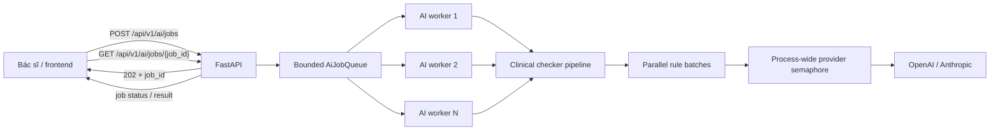
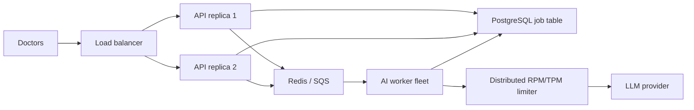

# AI asynchronous jobs, concurrency và rate-limit handling

## 1. Mục tiêu

Tài liệu này mô tả cơ chế xử lý nhiều yêu cầu kiểm tra bệnh án đồng thời khi backend gọi OpenAI, Anthropic hoặc một
provider tương thích. Cơ chế được thiết kế để:

- Không bắt request HTTP của bác sĩ chờ toàn bộ quá trình phân tích LLM.
- Hấp thụ các đợt tải tăng đột ngột bằng hàng đợi có giới hạn.
- Giới hạn chính xác số HTTP request đang đồng thời đi tới provider.
- Retry lỗi tạm thời mà không tạo ra retry storm.
- Không giữ bệnh án trong bộ nhớ lâu hơn thời gian cần thiết.
- Cung cấp trạng thái rõ ràng để frontend theo dõi tiến độ.
- Tạo một contract HTTP ổn định để sau này thay queue local bằng Redis, SQS hoặc Celery mà không phải đổi frontend.

Đây là lớp bảo vệ kỹ thuật cho provider API. Kết quả LLM vẫn phải tuân theo quy trình privacy, validation, audit và
human review của hệ thống clinical compliance checker.

## 2. Vì sao cần hàng đợi và giới hạn concurrency?

Các provider thường áp dụng nhiều giới hạn đồng thời:

| Loại giới hạn | Ý nghĩa |
| --- | --- |
| RPM | Số request tối đa trong một phút |
| Input TPM | Tổng input token tối đa trong một phút |
| Output TPM | Tổng output token tối đa trong một phút |
| Concurrent requests | Số request đang được xử lý đồng thời |
| Usage/spending limit | Hạn mức sử dụng hoặc chi phí theo ngày/tháng/project |

Nhiều API key thuộc cùng một project thường không tạo ra các quota độc lập. Nếu nhiều bác sĩ dùng chung backend,
traffic của họ sẽ được cộng vào cùng quota của project hoặc organization.

Pipeline hiện chia bộ tiêu chí thành nhiều batch để giảm kích thước output và chạy nhanh hơn. Với cấu hình
`LLM_BATCH_SIZE=10`, một bệnh án hiện có thể tạo khoảng 5 provider calls. Vì vậy:

```text
4 bệnh án đồng thời × 5 batch/bệnh án = tối đa khoảng 20 calls đồng thời
```

Giới hạn số bệnh án đang xử lý là chưa đủ. Hệ thống phải có thêm một semaphore ngay tại lớp provider để giới hạn từng
HTTP call thật.

## 3. Kiến trúc hiện tại



Các thành phần chính:

| Thành phần | File | Trách nhiệm |
| --- | --- | --- |
| Job HTTP API | `backend/api/app/routers/ai.py` | Submit và đọc trạng thái job |
| Queue/worker | `backend/api/app/ai_jobs.py` | Backpressure, worker pool và vòng đời job |
| App lifecycle | `backend/api/app/main.py` | Khởi động/dừng queue theo FastAPI lifespan |
| Provider adapter | `backend/ai/clinical_checker/provider.py` | Semaphore, HTTP call, retry và parse usage |
| Load test | `scripts/load_test_ai_jobs.py` | Mô phỏng nhiều bác sĩ gửi job đồng thời |

## 4. Vòng đời một job

Một job có các trạng thái:

```text
queued → processing → completed
                    ↘ failed
```

| Trạng thái | Ý nghĩa |
| --- | --- |
| `queued` | API đã nhận job và job đang chờ worker |
| `processing` | Worker đang redact, scan PII, áp rules và gọi provider |
| `completed` | Pipeline hoàn tất, kết quả sẵn sàng |
| `failed` | Job thất bại do validation, privacy, network hoặc provider |

Các timestamp được lưu theo UTC ISO 8601:

- `created_at`: thời điểm API nhận job.
- `started_at`: thời điểm worker bắt đầu xử lý.
- `completed_at`: thời điểm job hoàn tất hoặc thất bại.

Job queue tạo một deep copy của record khi submit. Sau khi job kết thúc, trường record nội bộ được xoá khỏi bộ nhớ,
không phụ thuộc job thành công hay thất bại. Public response không bao giờ trả lại raw record.

## 5. API contract

### 5.1 Submit job

```http
POST /api/v1/ai/jobs
Content-Type: application/json

{
  "record": {
    "...": "clinical record"
  }
}
```

Response thành công:

```http
HTTP/1.1 202 Accepted
Content-Type: application/json

{
  "job_id": "44331459-a7ba-45e9-b3bb-fef6a6ca98fd",
  "status": "queued",
  "status_url": "/api/v1/ai/jobs/44331459-a7ba-45e9-b3bb-fef6a6ca98fd"
}
```

`202` chỉ xác nhận job đã được nhận. Nó không khẳng định LLM đã hoàn thành hoặc kết quả hợp lệ.

`dry_run=true` không được hỗ trợ tại job endpoint. Dry-run tiếp tục sử dụng endpoint đồng bộ
`POST /api/v1/ai/check-record`.

### 5.2 Poll trạng thái

```http
GET /api/v1/ai/jobs/{job_id}
```

Response khi đang xử lý:

```json
{
  "job_id": "44331459-a7ba-45e9-b3bb-fef6a6ca98fd",
  "status": "processing",
  "created_at": "2026-07-18T06:00:00+00:00",
  "started_at": "2026-07-18T06:00:00.010000+00:00",
  "completed_at": null,
  "result": null,
  "error": null
}
```

Response khi hoàn tất:

```json
{
  "job_id": "44331459-a7ba-45e9-b3bb-fef6a6ca98fd",
  "status": "completed",
  "created_at": "2026-07-18T06:00:00+00:00",
  "started_at": "2026-07-18T06:00:00.010000+00:00",
  "completed_at": "2026-07-18T06:00:18.250000+00:00",
  "result": {
    "run_id": "pipeline-run-uuid",
    "result": {},
    "meta": {
      "status": "success",
      "model": "gpt-4.1-mini",
      "pipeline_version": "compact-final-v4",
      "latency_ms": 18240.5,
      "total_tokens": 9500,
      "api_calls": 5
    }
  },
  "error": null
}
```

### 5.3 Queue đầy

Nếu pending queue đã đạt `AI_JOB_MAX_QUEUE`:

```http
HTTP/1.1 429 Too Many Requests
Retry-After: 5

{
  "detail": "AI job queue đang đầy"
}
```

Frontend nên chờ ít nhất số giây trong `Retry-After`, thêm jitter nhỏ rồi submit lại. Không retry liên tục trong vòng
lặp không delay.

### 5.4 Job không tồn tại

```http
HTTP/1.1 404 Not Found

{
  "detail": "Không tìm thấy AI job"
}
```

Trong implementation local, job có thể mất sau khi process restart hoặc sau khi completed jobs cũ bị evict khỏi RAM.

## 6. Cấu hình

```env
# Số bệnh án được pipeline xử lý đồng thời.
AI_JOB_WORKERS=4

# Số job tối đa đang chờ, không bao gồm các job worker đã lấy ra xử lý.
AI_JOB_MAX_QUEUE=100

# Tổng HTTP calls thực sự được phép đồng thời trong một process.
# Giới hạn này bao phủ cả các rule batches chạy song song bên trong mỗi bệnh án.
LLM_MAX_CONCURRENCY=4

# Số tiêu chí tối đa trong một provider call; 0 tắt chia batch.
LLM_BATCH_SIZE=10

# Timeout của từng provider HTTP call.
LLM_TIMEOUT_SECONDS=90
```

### 6.1 Quan hệ giữa các cấu hình

- `AI_JOB_WORKERS` kiểm soát số bệnh án đang được xử lý.
- `LLM_BATCH_SIZE` ảnh hưởng số provider calls mà mỗi bệnh án tạo ra.
- `LLM_MAX_CONCURRENCY` là giới hạn cuối cùng tại network boundary.
- `AI_JOB_MAX_QUEUE` kiểm soát lượng backlog mà API chấp nhận.

Không đặt `LLM_MAX_CONCURRENCY` bằng `AI_JOB_WORKERS × batch_count`. Mục đích của provider semaphore là ngăn phép nhân
này tạo burst.

Giá trị khởi đầu khuyến nghị cho một API process:

```env
AI_JOB_WORKERS=4
AI_JOB_MAX_QUEUE=100
LLM_MAX_CONCURRENCY=4
```

Sau đó điều chỉnh dựa trên quota thật, input/output token trung bình, P95 latency và tỷ lệ `429`.

## 7. Retry provider

Provider adapter retry các lỗi tạm thời:

- HTTP `408`.
- HTTP `429`.
- HTTP `500`, `502`, `503`, `504`.
- Network interruption, timeout và connection error.

Tối đa 5 attempts được thực hiện cho một provider call.

### 7.1 Delay

Nếu provider trả `Retry-After`, hệ thống ưu tiên giá trị đó và cap thời gian chờ của một attempt ở 60 giây. Nếu header
không có hoặc không parse được, hệ thống dùng exponential backoff với full jitter:

```text
attempt 1: random 0–1 giây
attempt 2: random 0–2 giây
attempt 3: random 0–4 giây
attempt 4: random 0–8 giây
```

Full jitter làm giảm khả năng nhiều worker cùng retry tại một thời điểm.

### 7.2 Semaphore và retry

Semaphore chỉ được giữ trong lúc thực hiện network request. Khi request nhận `429` và cần chờ, permit được trả lại
trước khi sleep. Việc này tránh một request đang backoff chiếm chỗ của các request khác.

### 7.3 Lỗi không retry

Các lỗi HTTP khác, ví dụ authentication, payload sai hoặc request validation, không được retry vì retry cùng payload
không có khả năng tự khắc phục vấn đề.

Provider response body không được chèn vào error message hoặc log vì có khả năng chứa dữ liệu bắt nguồn từ request.

## 8. Frontend integration khuyến nghị

Luồng frontend:

1. Submit bệnh án bằng `POST /ai/jobs`.
2. Lưu `job_id` trong state.
3. Hiển thị trạng thái “Đang chờ” hoặc “Đang phân tích”.
4. Poll `status_url` mỗi 1–2 giây, hoặc dùng exponential polling tới tối đa khoảng 5 giây.
5. Dừng poll khi job là `completed` hoặc `failed`.
6. Khi `completed`, render kết quả kiểm tra.
7. Khi `failed`, hiển thị thông báo an toàn và correlation ID; không tự động submit một job mới vô hạn.

Không nên poll mỗi 100–500 ms ở production. Bản load-test dùng polling nhanh để đo thời gian chính xác, không phải cấu
hình frontend khuyến nghị.

Pseudo-code:

```typescript
const submitted = await post("/api/v1/ai/jobs", { record });

while (true) {
  await delay(1500);
  const job = await get(submitted.status_url);
  if (job.status === "completed") return job.result;
  if (job.status === "failed") throw new Error(job.error);
}
```

Production nên bổ sung `Idempotency-Key`. Nếu người dùng double-click hoặc browser retry request, backend cần trả lại
job cũ thay vì tạo thêm provider calls và chi phí trùng lặp.

## 9. Load test bằng provider thật

Script:

```text
scripts/load_test_ai_jobs.py
```

Ví dụ chạy 6 job với tối đa 4 client threads:

```bash
backend/api/.venv312/bin/python scripts/load_test_ai_jobs.py \
  --base-url http://127.0.0.1:4000 \
  --jobs 6 \
  --concurrency 4 \
  --deadline-seconds 300
```

Các tham số:

| Tham số | Mặc định | Ý nghĩa |
| --- | ---: | --- |
| `--base-url` | `http://127.0.0.1:4000` | Backend cần test |
| `--jobs` | `6` | Tổng số bệnh án được submit |
| `--concurrency` | `4` | Số client threads submit/poll đồng thời |
| `--data-dir` | `data` | Folder chứa JSON bệnh án mẫu |
| `--poll-seconds` | `0.5` | Poll interval của load test |
| `--deadline-seconds` | `180` | Deadline cho mỗi job |

Script không in bệnh án, API key hoặc raw provider response. Output chỉ bao gồm số lượng job, latency, token và lỗi đã
được backend sanitize.

### 9.1 Kết quả thực tế ngày 2026-07-18

Provider/model:

```text
OpenAI / gpt-4.1-mini
```

Sau khi áp `LLM_MAX_CONCURRENCY=4`:

| Chỉ số | Kết quả |
| --- | ---: |
| Jobs | 6 |
| Client concurrency | 4 |
| Completed | 6 |
| Failed | 0 |
| Provider HTTP calls | 30 |
| HTTP 429 | 0 |
| Tổng thời gian | 39,016 giây |
| Latency thấp nhất | 12,643 giây |
| Latency trung bình | 22,639 giây |
| Latency cao nhất | 32,446 giây |
| Tổng token | 60.453 |
| Chi phí ước tính | 0,033715 USD |

Chi phí là ước tính theo giá cấu hình tại thời điểm test, không phải billing record của provider.

Test ban đầu chưa có provider-level semaphore hoàn tất trong 28,385 giây, nhưng một lúc có thể tạo gần 20 calls do
4 jobs nhân với 5 batches. Load test này phát hiện rằng chỉ giới hạn worker không đủ. Sau khi sửa, wall time tăng lên
39,016 giây nhưng burst được giới hạn đúng 4 calls. Đây là trade-off chủ động giữa latency và độ ổn định.

## 10. Test tự động

Chạy toàn bộ test:

```bash
PYTHONPATH=backend/api:backend/ai \
  backend/api/.venv312/bin/python -m pytest backend/ai/tests backend/api/tests -q
```

Các nhóm test liên quan:

- Queue xử lý job và xoá record sau khi hoàn tất.
- Queue từ chối job khi backlog đầy.
- Job endpoint từ chối dry-run.
- Unknown job trả `404`.
- Retry tôn trọng `Retry-After`.
- Retry cap `Retry-After` ở 60 giây.
- Backoff dùng jitter khi provider không trả header.

Kết quả tại thời điểm viết tài liệu: 31 tests passed.

## 11. Monitoring production

Nên xuất các metric sau ra Prometheus, OpenTelemetry hoặc hệ thống tương đương:

### Queue

- `ai_jobs_submitted_total`.
- `ai_jobs_completed_total`.
- `ai_jobs_failed_total`.
- `ai_job_queue_depth`.
- `ai_job_oldest_queued_seconds`.
- `ai_job_queue_rejected_total`.
- `ai_job_wait_seconds` từ `created_at` đến `started_at`.

### Provider

- `llm_requests_total{provider,model,status}`.
- `llm_requests_in_flight{provider,model}`.
- `llm_rate_limit_429_total`.
- `llm_retry_total{reason}`.
- `llm_request_latency_seconds` P50/P95/P99.
- `llm_input_tokens_total`.
- `llm_output_tokens_total`.
- `llm_estimated_cost_usd_total`.
- Rate-limit remaining/reset headers nếu provider cung cấp.

### Clinical pipeline

- Số API calls trên một bệnh án.
- Số batch và batch size.
- Tỷ lệ PII fail-closed.
- Tỷ lệ schema/coverage validation failure.
- Pipeline version, rules version, model và provider.

Alert gợi ý:

- `429` > 1% trong 5 phút.
- P95 queue wait vượt SLA.
- Oldest queued job vượt 2–5 phút tùy quy trình.
- Provider failure > 5% trong 5 phút.
- Chi phí theo giờ/ngày vượt budget.

Không dùng nội dung bệnh án, raw prompt hoặc raw response làm metric label hay log field.

## 12. Giới hạn của implementation hiện tại

Queue hiện tại nằm trong RAM của một process. Các giới hạn quan trọng:

1. Job và result mất khi process restart.
2. Không chia sẻ queue giữa nhiều Uvicorn/Gunicorn workers.
3. `LLM_MAX_CONCURRENCY` chỉ giới hạn trong một process.
4. Nhiều backend replicas sẽ có nhiều semaphore độc lập và tổng concurrency có thể vượt quota.
5. Chưa có fair scheduling theo bác sĩ/phòng ban.
6. Chưa có idempotency hoặc deduplication.
7. Chưa có distributed RPM/TPM limiter.
8. Chưa có dead-letter queue.
9. Client phải poll; chưa có SSE/webhook.
10. Job result chỉ nằm trong RAM, chưa có durable audit storage riêng cho job state.

Vì vậy, phiên bản này chỉ nên deploy với **một API process/worker**. Không cấu hình nhiều Gunicorn workers và không
horizontal scale replica cho đến khi hoàn thành distributed queue.

## 13. Kiến trúc production nhiều replica

Khi cần scale ngang, giữ nguyên HTTP contract nhưng thay `AiJobQueue` bằng queue bền vững:



### 13.1 Durable job table

Tối thiểu nên lưu:

```text
id
tenant_id / hospital_id
requested_by
status
created_at
started_at
completed_at
attempt_count
pipeline_version
rules_version
provider
model
result_reference
safe_error_code
idempotency_key
```

Không mặc định lưu raw record vào job table. Nếu workflow bắt buộc phải lưu input để worker lấy lại sau restart, dữ
liệu phải được mã hóa, access-controlled, có retention policy, audit trail và phê duyệt privacy phù hợp.

### 13.2 Distributed token-aware limiter

Limiter production phải kiểm soát ít nhất hai bucket:

- Request bucket: RPM.
- Token bucket: input/output TPM ước tính.

Trước mỗi call, worker ước tính input token và output budget. Worker chỉ gọi provider khi cả request permit và token
permit đều sẵn sàng. Sau response, reconciliate reservation với usage thực tế.

Nên chỉ sử dụng khoảng 70–80% quota provider để giữ headroom cho token estimation error, retry và traffic burst.

### 13.3 Fair scheduling

Để một bác sĩ không chiếm toàn bộ worker:

- Giới hạn active jobs theo user hoặc hospital.
- Round-robin/weighted queue theo tenant.
- Interactive lane ưu tiên hơn batch audit lane.
- Giới hạn queued jobs trên mỗi user.
- Deduplicate theo hash của safe record + rules version + pipeline version.

## 14. Security và privacy

- `.env` chỉ dùng cho local development.
- Production phải lấy API key từ secret manager của hosting platform.
- Không đưa key vào frontend, Docker image hoặc source control.
- Tách key/project cho development, staging và production.
- Bật spending limit, budget alert và key rotation.
- Chỉ worker/backend được quyền đọc provider key.
- Không ghi raw bệnh án, prompt hoặc provider response vào application log.
- Tiếp tục áp minimum-necessary transformation và PII fail-closed trước provider call.
- Đánh giá DPA, retention, data residency và Zero Data Retention theo yêu cầu bệnh viện.
- Job endpoint cần áp authentication/authorization trước khi public production.

## 15. Troubleshooting

### Tất cả request trả `404` khi test

Có thể một backend cũ đang giữ port. Kiểm tra OpenAPI của process đang chạy hoặc dùng port khác:

```bash
curl -I http://127.0.0.1:4000/docs
```

Khởi động phiên bản mới ở port khác rồi truyền đúng `--base-url` cho load-test.

### Job ở `queued` quá lâu

- Kiểm tra worker queue đã được start trong FastAPI lifespan.
- Kiểm tra `AI_JOB_WORKERS` không bằng 0; code sẽ clamp tối thiểu thành 1.
- Kiểm tra provider calls có đang timeout hoặc giữ semaphore lâu không.
- Kiểm tra queue depth và oldest queued time.

### Job `failed` với HTTP 429 provider

- Xem quota hiện tại trong provider dashboard.
- Giảm `LLM_MAX_CONCURRENCY`.
- Giảm batch parallelism hoặc tăng `LLM_BATCH_SIZE` có kiểm soát.
- Kiểm tra input/output TPM, không chỉ RPM.
- Xác nhận `Retry-After` được provider trả và retry đã chạy.
- Nếu tải ổn định vẫn vượt quota, yêu cầu nâng usage tier/quota.

### Latency tăng sau khi bật semaphore

Đây có thể là hành vi đúng. Các calls đang chờ permit thay vì tạo burst. Chỉ tăng `LLM_MAX_CONCURRENCY` sau khi xác
nhận provider quota, P95 latency, token rate và tỷ lệ `429` cho phép.

### Queue trả `429`

Queue đã đạt `AI_JOB_MAX_QUEUE`. Frontend cần tôn trọng `Retry-After`. Nếu tình trạng kéo dài, tăng throughput hợp lệ,
giảm thời gian mỗi job hoặc triển khai durable distributed queue. Không chỉ tăng queue vô hạn vì điều đó che giấu quá
tải và làm thời gian chờ tăng không kiểm soát.

### Job mất sau khi restart

Đây là giới hạn đã biết của in-memory queue. Chuyển job state/result sang PostgreSQL và queue message sang Redis/SQS
trước khi yêu cầu recovery sau restart.

## 16. Checklist trước production

- [ ] API job endpoints được bảo vệ bằng authentication và authorization.
- [ ] Chỉ chạy một API process khi còn dùng in-memory queue.
- [ ] `AI_JOB_WORKERS`, `AI_JOB_MAX_QUEUE` và `LLM_MAX_CONCURRENCY` được cấu hình rõ ràng.
- [ ] Quota RPM/input TPM/output TPM thật đã được ghi nhận từ provider dashboard.
- [ ] Load test staging dùng dữ liệu giả hoặc de-identified đã đạt SLA.
- [ ] `429`, retry, queue depth, latency, token và cost có dashboard/alert.
- [ ] API key nằm trong secret manager và có rotation policy.
- [ ] DPA, retention và data residency đã được duyệt.
- [ ] Không có raw clinical data trong logs/metrics.
- [ ] Có spending limit và budget alert.
- [ ] Có kế hoạch Redis/SQS/PostgreSQL trước khi scale nhiều replica.
- [ ] Frontend tôn trọng `202`, polling interval và `Retry-After`.
- [ ] Kết quả LLM có validation, audit và human review phù hợp.

## 17. File tham chiếu

- `backend/api/app/ai_jobs.py`: queue và worker pool.
- `backend/api/app/routers/ai.py`: submit/status endpoints.
- `backend/api/app/main.py`: FastAPI lifespan.
- `backend/ai/clinical_checker/provider.py`: provider semaphore và retry.
- `scripts/load_test_ai_jobs.py`: load test bằng API thật.
- `results/api-runs.jsonl`: telemetry run; không chứa raw record theo thiết kế hiện tại.
- `.env.example`: cấu hình mẫu đầy đủ.

