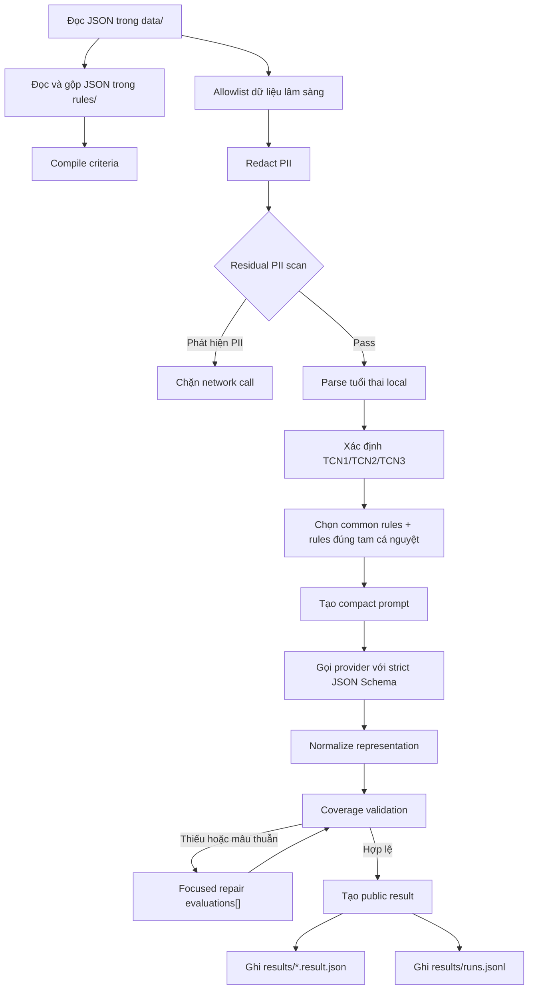

# AI Clinical Compliance Pipeline

## 1. Mục đích

Pipeline này kiểm tra các hồ sơ khám bệnh dạng JSON trong thư mục `data/` có tuân thủ các tiêu chí đã định nghĩa
trong thư mục `rules/` hay không. Việc đánh giá nội dung lâm sàng được thực hiện bằng API của provider LLM
(OpenAI-compatible hoặc Anthropic), không phải bởi Coding Agent đang phát triển repository.

Các mục tiêu chính:

- Không gửi PII trực tiếp tới provider.
- Chỉ gửi dữ liệu và rules tối thiểu cần thiết.
- Chọn rules phù hợp với tam cá nguyệt trước API call.
- Trả danh sách ID đạt dưới dạng compact list.
- Chỉ ghi chi tiết cho tiêu chí chưa đạt hoặc chưa đủ dữ liệu kiểm chứng.
- Không ghi các rule ngoài tam cá nguyệt hoặc `KHONG_AP_DUNG` vào result public.
- Bắt buộc kiểm tra coverage và cấu trúc response trước khi chấp nhận kết quả.
- Ghi token, latency, cost và metadata của từng run để benchmark các pipeline version.
- Mọi kết quả chỉ là hỗ trợ kiểm tra và cần human review.

## 2. Phạm vi và nguyên tắc an toàn

Pipeline là công cụ kiểm tra chất lượng hồ sơ, không phải công cụ chẩn đoán hoặc tự động đưa ra quyết định điều trị.
Nó không được tự động sửa bệnh án, ký hồ sơ hoặc thay thế đánh giá của bác sĩ/điều dưỡng.

Các nguyên tắc:

1. **Minimum necessary:** chỉ gửi các field lâm sàng cần cho việc kiểm tra.
2. **Fail closed:** nếu còn mẫu PII sau redaction, chặn request trước network boundary.
3. **No inference:** LLM không được tự tạo dữ kiện không có trong hồ sơ.
4. **Explicit uncertainty:** không đủ bằng chứng phải dùng `THIEU_DU_LIEU`.
5. **Strict validation:** JSON hợp lệ chưa đủ; coverage và status cũng phải hợp lệ.
6. **Human in the loop:** kết quả cuối cần nhân viên y tế xác nhận.

## 3. Cấu trúc thư mục

```text
thap-rua-clinical-copilot/
├── .env                              # Secret local, không commit
├── .env.example                      # Cấu hình mẫu
├── data/                             # Hồ sơ JSON đầu vào
├── rules/                            # Rule JSON
├── results/                          # Result và telemetry, bị gitignore
│   ├── sim_kham1.result.json
│   ├── sim_kham2.result.json
│   ├── sim_kham3.result.json
│   └── runs.jsonl
├── backend/ai/
│   ├── clinical_checker/
│   │   ├── cli.py                    # Batch CLI và file I/O
│   │   ├── config.py                 # Đọc .env
│   │   ├── privacy.py                # Allowlist, redaction, PII scan
│   │   ├── provider.py               # HTTP adapter OpenAI/Anthropic
│   │   └── pipeline.py               # Scope, prompt, validation, repair, telemetry
│   ├── tests/                        # Unit tests
│   └── versions/                     # Manifest các pipeline version
└── docs/
    └── ai-clinical-compliance-pipeline.md
```

## 4. Cách chạy

### 4.1 Cấu hình API key

Sao chép `.env.example` thành `.env` nếu `.env` chưa có, sau đó điền key trực tiếp trên máy local:

```env
LLM_PROVIDER=openai
LLM_MODEL=gpt-4.1-mini
LLM_API_KEY=replace_with_real_key
LLM_BASE_URL=https://api.openai.com/v1
LLM_TIMEOUT_SECONDS=90
LLM_MAX_OUTPUT_TOKENS=12000
LLM_INPUT_PRICE_PER_MILLION_USD=0.40
LLM_OUTPUT_PRICE_PER_MILLION_USD=1.60
PIPELINE_VERSION=compact-applicable-v3.1
PII_FAIL_CLOSED=true
```

Không gửi API key qua chat, không ghi vào tài liệu và không commit `.env`. File `.env` đã được `.gitignore` bảo vệ.

Hai giá token chỉ dùng để tính cost ước tính. Chúng phải được cập nhật theo model và hợp đồng provider thực tế.

### 4.2 Chạy unit tests

```bash
npm run test:ai
```

### 4.3 Chạy dry-run

```bash
npm run check:ai:dry
```

Dry-run thực hiện:

```text
Đọc data/rules
→ parse JSON
→ allowlist
→ redaction
→ PII scan
→ xác định tam cá nguyệt
→ lọc criteria
→ tạo prompt
→ dừng trước API call
```

Dry-run không tạo kết quả `DAT/KHONG_DAT`, không dùng token và không phát sinh API cost.

### 4.4 Chạy API thật cho toàn bộ folder

```bash
npm run check:ai
```

Command tương đương:

```bash
PYTHONPATH=backend/ai python -m clinical_checker.cli \
  --data data \
  --rules rules \
  --output results
```

### 4.5 Chạy một hồ sơ

```bash
PYTHONPATH=backend/ai python -m clinical_checker.cli \
  --data data/sim_kham1.json \
  --rules rules \
  --output results/sim_kham1.result.json
```

## 5. Tổng quan luồng xử lý



## 6. Bước 1 — Đọc data và rules

Việc đọc file hoàn toàn chạy local, không gọi API.

CLI sử dụng thư viện chuẩn Python:

- `pathlib.Path.glob("*.json")` để tìm file.
- `Path.read_text(encoding="utf-8-sig")` để đọc UTF-8 và xử lý BOM nếu có.
- `json.loads()` để parse JSON.

Rules được đọc một lần khi CLI bắt đầu và gộp thành:

```json
{
  "sources": ["rules_kham_thai.json"],
  "rules": []
}
```

Trong một batch, mỗi data file được đọc một lần. Network chỉ bắt đầu khi `call_llm()` được gọi.

## 7. Bước 2 — Compile criteria

`extract_required_criteria()` chuyển cấu trúc rules thành một danh sách phẳng dễ đưa vào prompt.

Ví dụ:

```json
{
  "item_id": "R02.1",
  "criterion": "Đo mạch và huyết áp",
  "severity": "CRITICAL",
  "scope": {
    "ap_dung": "moi_lan_kham"
  },
  "tan_suat": "mỗi lần khám"
}
```

Rule có `items[]` sử dụng ID của từng item. Rule lịch hẹn `R07` hiện chưa có child ID nên được đánh giá ở mức
`R07`.

File rules hiện tại compile thành 53 criteria trước khi scope filtering.

## 8. Bước 3 — Allowlist và redaction PII

### 8.1 Structural allowlist

Chỉ các section sau có thể đi tiếp:

```text
patient
visit
vital_signs
clinical_note
diagnosis
```

Các field được giữ:

```text
patient.age
patient.gender
visit.reason
visit.department
visit.clinic
vital_signs.*
clinical_note.dien_bien
clinical_note.huong_xu_tri
diagnosis.icd10
diagnosis.mo_ta
```

Các field định danh bị loại khỏi cấu trúc:

```text
record_id
patient.full_name
patient.phone
patient.address
visit.visit_code
visit.visit_datetime
doctor
signed_at
```

### 8.2 Redaction trong free text

Free text có thể vô tình chứa PII nên pipeline tiếp tục thay thế:

- Email.
- Số điện thoại Việt Nam.
- CCCD/CMND.
- Mã bệnh án/lượt khám.
- Ngày tuyệt đối.
- Các identifier đã biết từ record gốc.

Ví dụ:

```text
Dự sanh ngày: 26/01/2027
```

trở thành:

```text
Dự sanh ngày: [REDACTED_ABSOLUTE_DATE]
```

### 8.3 Residual PII scan

Sau redaction, payload được serialize và quét lại. Nếu còn mẫu PII và `PII_FAIL_CLOSED=true`:

```text
status = blocked_pii
API calls = 0
cost = 0
```

## 9. Bước 4 — Xác định tam cá nguyệt local

`detect_gestational_age()` không dùng LLM. Nó ưu tiên field cấu trúc:

```json
{
  "diagnosis": {
    "tuoi_thai_tuan": 12,
    "tuoi_thai_ngay": 3
  }
}
```

Nếu field cấu trúc không có, parser đọc `diagnosis.mo_ta`:

```text
THAI 12 TUẦN 03 NGÀY
```

Kết quả:

```json
{
  "detected": true,
  "weeks": 12,
  "days": 3,
  "total_days": 87,
  "trimester": "TCN1",
  "source": "diagnosis.mo_ta"
}
```

Boundary:

| Tam cá nguyệt | Tuổi thai |
|---|---|
| `TCN1` | Đến 13 tuần 6 ngày |
| `TCN2` | 14 tuần đến 28 tuần 6 ngày |
| `TCN3` | Từ 29 tuần |

Các boundary được unit test:

```text
13 tuần 6 ngày → TCN1
14 tuần 0 ngày → TCN2
28 tuần 6 ngày → TCN2
29 tuần 0 ngày → TCN3
```

Nếu không xác định được tuổi thai, pipeline fail-safe bằng cách không loại bất kỳ trimester rule nào.

## 10. Bước 5 — Lọc criteria theo tam cá nguyệt

`filter_criteria_by_trimester()` giữ:

1. Các rule không có `scope.tam_ca_nguyet` — common rules.
2. Các rule có `scope.tam_ca_nguyet` đúng với hồ sơ.

Ví dụ TCN1:

```text
Giữ: R01 + R02 + R03 + R06 + R07
Không gửi LLM: R04 + R05
```

Kết quả trên dữ liệu mẫu:

| Hồ sơ | Tuổi thai | TCN | Criteria trước | Gửi LLM | Không gửi |
|---|---:|---|---:|---:|---:|
| `sim_kham1` | 12w3d | TCN1 | 53 | 33 | 20 |
| `sim_kham2` | 21w5d | TCN2 | 53 | 32 | 21 |
| `sim_kham3` | 26w1d | TCN2 | 53 | 32 | 21 |

Rule thuộc tam cá nguyệt khác không xuất hiện trong result public.

## 11. Bước 6 — Tạo prompt

### 11.1 System prompt

System prompt định nghĩa:

- Vai trò compliance checker.
- Chỉ sử dụng dữ liệu cung cấp.
- Không suy diễn dữ kiện.
- Quy tắc sử dụng `THIEU_DU_LIEU`.
- Phân loại mỗi ID đúng một lần.
- Không thêm ID ngoài criteria.
- Trả JSON theo contract.
- Kết quả cần human review.

### 11.2 User prompt

User prompt gồm:

```text
REQUIRED_CRITERIA
OUTPUT_CONTRACT
CLINICAL_RECORD
```

`REQUIRED_CRITERIA` chỉ chứa common rules và rules của tam cá nguyệt phù hợp.

`CLINICAL_RECORD` là payload sau allowlist, redaction và residual PII scan.

## 12. Bước 7 — Provider API

### 12.1 OpenAI-compatible

Adapter gọi:

```text
POST {LLM_BASE_URL}/chat/completions
```

Header:

```text
Authorization: Bearer <LLM_API_KEY>
Content-Type: application/json
```

API key không được ghi vào log hoặc exception.

### 12.2 Anthropic

Adapter gọi:

```text
POST {LLM_BASE_URL}/messages
```

Header gồm `x-api-key` và `anthropic-version`.

### 12.3 Timeout

Request timeout được lấy từ `LLM_TIMEOUT_SECONDS`. HTTP error chỉ ghi status code; response body của provider không
được echo vào exception vì có thể chứa lại request data.

## 13. Bước 8 — Strict Structured Outputs

Với OpenAI, pipeline sử dụng `response_format: json_schema` và `strict: true`.

Schema bắt buộc:

- Top-level object.
- `dat_ids` phải là array string.
- `khong_ap_dung_ids` phải là array string.
- `exceptions` phải là array object.
- Exception status chỉ được `KHONG_DAT` hoặc `THIEU_DU_LIEU`.
- Required fields đầy đủ.
- `additionalProperties: false`.

Strict schema bảo đảm shape nhưng không thể bảo đảm ba arrays không chứa cùng một ID. Do đó local coverage validation
vẫn bắt buộc.

## 14. Compact provider contract

Provider được yêu cầu trả:

```json
{
  "thong_tin_lan_kham": {
    "tuoi_thai_tuan": 12,
    "tuoi_thai_ngay": 3,
    "phan_loai_nguy_co": "khong_ghi_nhan",
    "lan_kham_thu": null
  },
  "dat_ids": [
    "R01.1",
    "R01.2",
    "R02.4"
  ],
  "khong_ap_dung_ids": [
    "R02.2"
  ],
  "exceptions": [
    {
      "item_id": "R02.1",
      "trang_thai": "KHONG_DAT",
      "bang_chung": "",
      "ghi_chu": "Không ghi nhận huyết áp."
    }
  ],
  "tong_ket": {
    "vi_pham_critical": ["R02.1"],
    "khuyen_nghi": "Bổ sung sinh hiệu."
  }
}
```

`khong_ap_dung_ids` là field nội bộ phục vụ coverage validation. Nó không được ghi vào result public.

## 15. Normalize representation

Strict schema là cơ chế chính. Parser vẫn có normalization cho provider khác hoặc response lịch sử:

- Exceptions dạng array.
- Exceptions group theo `KHONG_DAT`/`THIEU_DU_LIEU`.
- Exceptions dạng map `item_id → status/object`.
- Alias `status`, `evidence`, `reason` được chuyển sang field tiếng Việt tương ứng.

Normalization chỉ thay đổi representation, không tự thay đổi kết luận lâm sàng. Nếu không xác định được status một
cách chắc chắn, response bị chặn.

## 16. Coverage validation

Pipeline kiểm tra tập hợp:

```text
dat_ids
∪ khong_ap_dung_ids
∪ exception item_ids
= REQUIRED_CRITERIA
```

Các điều kiện:

- Không thiếu ID.
- Không có ID ngoài rules.
- Không có ID trùng cùng hoặc khác nhóm.
- Status thuộc tập cho phép.
- Số ID bằng số criteria gửi LLM.

Nếu một ID bị lặp cùng một trạng thái, code có thể deduplicate representation. Nếu một ID nằm trong hai nhóm có
hai trạng thái khác nhau, code không tự chọn kết luận mà gửi focused repair.

## 17. Focused repair

Repair chỉ gửi các ID bị thiếu hoặc mâu thuẫn, không chạy lại toàn bộ criteria.

Repair dùng contract riêng:

```json
{
  "evaluations": [
    {
      "item_id": "R06.2",
      "trang_thai": "DAT",
      "bang_chung": "SẮT 30MG...",
      "ghi_chu": "Có chỉ định vi chất."
    }
  ]
}
```

Mỗi ID repair xuất hiện đúng một hàng. Strict schema cho phép status:

```text
DAT
KHONG_DAT
KHONG_AP_DUNG
THIEU_DU_LIEU
```

Telemetry ghi:

```json
{
  "api_calls": 2,
  "repaired_criteria": ["R06.2"]
}
```

## 18. Public result contract

Result ghi vào `results/<input>.result.json` không chứa rules ngoài tam cá nguyệt và không chứa
`KHONG_AP_DUNG`.

Ví dụ:

```json
{
  "run_id": "...",
  "result": {
    "thong_tin_lan_kham": {
      "tuoi_thai_tuan": 12,
      "tuoi_thai_ngay": 3,
      "phan_loai_nguy_co": "khong_ghi_nhan",
      "lan_kham_thu": null
    },
    "dat_ids": [
      "R01.1",
      "R01.2",
      "R02.4"
    ],
    "exceptions": [
      {
        "item_id": "R02.1",
        "trang_thai": "KHONG_DAT",
        "bang_chung": "",
        "ghi_chu": "Không ghi nhận huyết áp."
      }
    ],
    "tong_ket": {
      "vi_pham_critical": ["R02.1"],
      "khuyen_nghi": "Bổ sung sinh hiệu."
    },
    "criteria_summary": {
      "criteria_applicable": 18,
      "dat_count": 17,
      "khong_dat_count": 1,
      "thieu_du_lieu_count": 0
    },
    "scope_filter": {
      "gestational_age": {
        "weeks": 12,
        "days": 3,
        "trimester": "TCN1"
      },
      "criteria_sent_to_llm": 33,
      "criteria_excluded_locally": 20
    }
  },
  "telemetry": {}
}
```

### 18.1 `dat_ids`

Chỉ chứa ID. Không evidence và không explanation để giảm output token.

### 18.2 `exceptions`

Chỉ chứa:

- `KHONG_DAT`: có đủ dữ liệu để kết luận chưa đáp ứng.
- `THIEU_DU_LIEU`: chưa đủ bằng chứng để xác minh.

### 18.3 Những gì bị loại khỏi public result

- Rule thuộc tam cá nguyệt khác.
- Criteria được model đánh giá `KHONG_AP_DUNG`.
- Evidence/ghi chú cho criteria `DAT`.
- Raw prompt.
- Raw provider response.
- API key.

## 19. Batch error isolation

Một file lỗi không làm các file sau bị bỏ qua. CLI ghi:

```json
{
  "status": "error",
  "source_file": "sim_kham2.json",
  "error_type": "CriteriaValidationError",
  "error": "..."
}
```

sau đó tiếp tục hồ sơ tiếp theo. Sau batch, process exit code khác 0 nếu có ít nhất một file thất bại.

## 20. Telemetry

Mỗi run ghi một dòng vào `results/runs.jsonl`.

Ví dụ:

```json
{
  "run_id": "...",
  "started_at": "2026-07-17T...Z",
  "pipeline_version": "compact-applicable-v3.1",
  "provider": "openai",
  "model": "gpt-4.1-mini",
  "status": "success",
  "gestational_age": {
    "weeks": 12,
    "days": 3,
    "trimester": "TCN1"
  },
  "criteria_count_before_scope": 53,
  "criteria_count_after_scope": 33,
  "excluded_by_scope_count": 20,
  "input_tokens": 4775,
  "output_tokens": 490,
  "total_tokens": 5265,
  "estimated_cost_usd": 0.002694,
  "latency_ms": 12351.6,
  "api_calls": 2,
  "repaired_criteria": ["R01.2"],
  "pii_scan_passed": true,
  "request_ids": ["req_..."]
}
```

### 20.1 Status của run

| Status | Ý nghĩa | API call |
|---|---|---:|
| `dry_run` | Hoàn thành local stages, dừng trước provider | 0 |
| `success` | Provider result đã parse và validate thành công | 1 hoặc nhiều hơn |
| `error` | Network/provider/parse/schema/coverage/write thất bại | Có thể 0 hoặc nhiều hơn |
| `blocked_pii` | Residual PII scan không pass | 0 |

`success` là trạng thái kỹ thuật của pipeline, không có nghĩa hồ sơ đạt toàn bộ rules.

### 20.2 Hash phục vụ truy vết

Telemetry ghi:

```text
prompt_sha256
rules_sha256
input_sha256
output_sha256
```

Hash dùng để nhận biết version/input thay đổi mà không lưu raw prompt trong telemetry. Hash không thay thế access
control hoặc audit system.

### 20.3 Cost

Cost được tính:

```text
input_tokens × input_price / 1,000,000
+ output_tokens × output_price / 1,000,000
```

Nếu có repair, token và cost của tất cả API calls được cộng lại.

## 21. Pipeline versions

### `baseline-v1`

- Gửi toàn bộ 53 criteria.
- Row-oriented output cho mọi criteria.
- Output token cao.

### `trimester-v2`

- Parse tuổi thai local.
- Lọc criteria theo tam cá nguyệt.
- Giảm input/output token.

### `compact-output-v3`

- `dat_ids`, `khong_ap_dung_ids`, `exceptions`.
- Strict JSON Schema.
- Chỉ exceptions có explanation.

### `compact-applicable-v3.1`

- Public result chỉ còn `dat_ids` và `exceptions`.
- Rule ngoài tam cá nguyệt không xuất hiện.
- `KHONG_AP_DUNG` không xuất hiện.
- Repair sử dụng `evaluations[]` để tránh cross-array conflict.

## 22. Benchmark hiện có

Benchmark trên ba hồ sơ mẫu cho thấy việc lọc tam cá nguyệt và compact output giảm đáng kể output token, latency và
cost. Các số liệu chi tiết được lưu trong manifest tại `backend/ai/versions/` và telemetry `results/runs.jsonl`.

Không sử dụng benchmark ba hồ sơ này để kết luận chất lượng lâm sàng. Cần gold dataset đã de-identify và đánh giá
độc lập bởi chuyên gia.

## 23. Unit tests

Test hiện bao phủ:

- Loại PII cấu trúc và trong free text.
- Parse tuổi thai.
- Boundary tam cá nguyệt.
- Fail-safe khi không tìm thấy tuổi thai.
- Scope filtering.
- Compact output expansion.
- Missing/duplicate/unknown IDs.
- Grouped exceptions và ID-map normalization.
- Strict JSON Schema shape.
- Public result không chứa `KHONG_AP_DUNG`.
- Focused repair row coverage.

Chạy:

```bash
npm run test:ai
```

## 24. Failure modes và cách xử lý

### API key chưa cấu hình

```text
RuntimeError: LLM_API_KEY chua duoc cau hinh
```

Kiểm tra `.env`, không commit key.

### Network/DNS lỗi

```text
URLError
TimeoutError
```

Run được ghi `error`; các file khác vẫn tiếp tục.

### Provider HTTP error

```text
HTTP 401 → key/auth
HTTP 429 → rate limit
HTTP 5xx → provider/server
```

Response body không được log.

### JSON parse error

Provider không trả JSON hợp lệ hoặc output bị cắt. Run bị chặn.

### Coverage error

Các trường hợp:

- Thiếu ID.
- ID lạ.
- ID trùng.
- Một ID ở hai nhóm mâu thuẫn.
- Status ngoài enum.

Pipeline dùng focused repair nếu có thể; nếu repair vẫn không hợp lệ, run thất bại.

### PII block

Nếu residual scan phát hiện PII, request không được gửi.

## 25. Privacy và lưu trữ

`results/` bị `.gitignore` vì result có thể chứa nội dung lâm sàng trong exceptions. Không commit result thật lên GitHub.

Không log:

- API key.
- Raw prompt.
- Raw clinical record.
- Raw provider response.
- PII đã bị loại.

Cần thiết kế thêm trước production:

- Encryption at rest.
- RBAC.
- Audit access.
- Retention/deletion policy.
- Key rotation.
- Data processing agreement với provider.
- Region/data residency review.
- Incident response.

## 26. Những giới hạn hiện tại

1. Parser tuổi thai phụ thuộc field cấu trúc hoặc pattern trong `diagnosis.mo_ta`.
2. Nếu tuổi thai sai trong nguồn, scope filter cũng có thể sai.
3. Conditional applicability vẫn cần LLM đánh giá.
4. Structured output bảo đảm shape nhưng không bảo đảm kết luận lâm sàng đúng.
5. Focused repair làm tăng input token và số API calls.
6. HTTP adapter hiện chưa dùng async connection pooling.
7. Batch đang chạy tuần tự.
8. Chưa có persistent result cache.
9. Chưa có stage-level latency chi tiết.
10. Chưa có gold dataset hoặc chỉ số precision/recall/F1.

## 27. Hướng tối ưu tiếp theo

### 27.1 Giảm repair rate

- Thử status-map contract thay vì ba arrays.
- Benchmark prompt wording.
- Ghi repair rate theo model/version.
- Không tự giải quyết kết luận mâu thuẫn bằng code.

### 27.2 Deterministic rules

Các tiêu chí có thể kiểm tra local:

- Mạch/huyết áp có null hay không.
- Chiều cao/cân nặng/BMI.
- ICD code.
- Liều sắt/acid folic/canxi.
- Tuổi thai và lịch tái khám.

LLM chỉ nên xử lý free text khó định lượng.

### 27.3 Result cache

Cache key đề xuất:

```text
provider
+ model
+ pipeline_version
+ prompt_sha256
+ rules_sha256
+ input_sha256
+ output_schema_version
```

Cache hit vẫn phải chạy PII scan và validation. Không cache run lỗi.

### 27.4 Async/concurrency

Chuyển sang `httpx.AsyncClient` và `asyncio.Semaphore` để:

- Tái sử dụng connection.
- Chạy nhiều hồ sơ song song.
- Giảm wall-clock latency của batch.
- Kiểm soát rate limit.

Parallelism giảm thời gian batch nhưng không giảm token/cost.

### 27.5 Stage telemetry

Nên bổ sung:

```text
load_ms
redaction_ms
scope_filter_ms
prompt_build_ms
api_ms
repair_ms
parse_ms
validation_ms
write_ms
```

### 27.6 Clinical evaluation

Cần tập gold đã de-identify và đo:

- Recall của `KHONG_DAT`.
- Recall riêng cho `CRITICAL`.
- False-negative rate.
- Precision.
- Agreement với chuyên gia.
- Schema-valid rate.
- Repair rate.
- Cost/hồ sơ.
- P50/P95 latency.

## 28. Checklist trước production

- [ ] Rules đã được bệnh viện phê duyệt và version hóa.
- [ ] Gold dataset đã de-identify.
- [ ] Clinical reviewer xác nhận threshold chất lượng.
- [ ] Privacy/security review hoàn tất.
- [ ] DPA và data residency của provider được duyệt.
- [ ] API key nằm trong secret manager, không chỉ `.env`.
- [ ] Rate limit, retry và backoff được cấu hình.
- [ ] Result encryption và retention policy được triển khai.
- [ ] Monitoring P50/P95 latency, error rate, repair rate và cost.
- [ ] Human-review workflow rõ ràng.
- [ ] Không có đường tự động ghi kết quả AI vào bệnh án chính thức.

## 29. Tệp triển khai chính

| File | Trách nhiệm |
|---|---|
| `backend/ai/clinical_checker/cli.py` | CLI, batch file discovery, error isolation, result write |
| `backend/ai/clinical_checker/config.py` | `.env` và settings |
| `backend/ai/clinical_checker/privacy.py` | Allowlist, redaction, residual PII scan |
| `backend/ai/clinical_checker/provider.py` | OpenAI/Anthropic HTTP calls và token usage |
| `backend/ai/clinical_checker/pipeline.py` | Scope, prompt, schema, normalization, validation, repair, telemetry |
| `backend/ai/tests/` | Unit tests |
| `backend/ai/versions/` | Pipeline manifests và benchmark metadata |
| `results/runs.jsonl` | Runtime telemetry local |

## 30. Tóm tắt contract cuối

```text
Input:
  data/*.json + rules/*.json

Local safety:
  allowlist → redact → PII scan

Local optimization:
  parse tuổi thai → filter tam cá nguyệt

Provider:
  compact strict JSON

Validation:
  coverage + status + focused repair

Public result:
  dat_ids[]
  exceptions[KHONG_DAT | THIEU_DU_LIEU]

Không ghi public result:
  rules ngoài tam cá nguyệt
  KHONG_AP_DUNG
  evidence cho DAT

Observability:
  results/runs.jsonl
```

